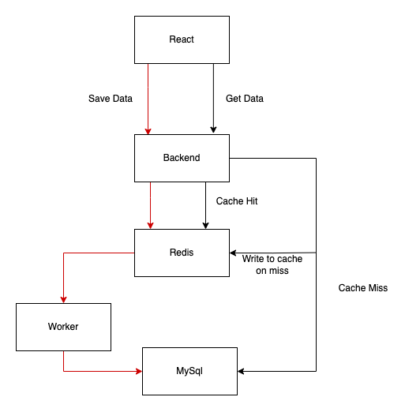
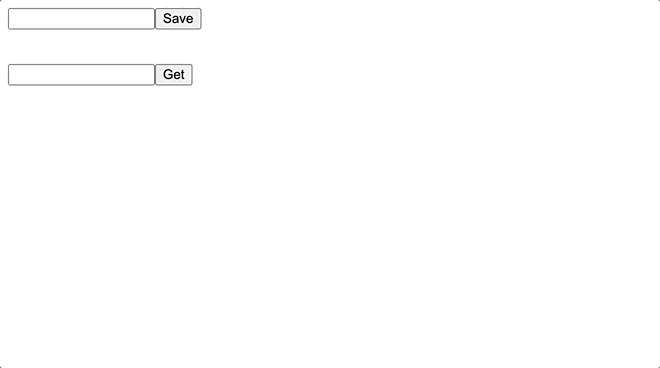

#An application built with React, Flask, MySql, Redis and docker

This is a demonstration of an application that takes an input from user, sends the data to a backend worker and the worker saves the data in database. For reading the data it first queries redis for any cache result. If no cache result is found it gets the data from MySql, saves it in redis(with a ttl) and returns the data to the user.   

In this project the following architecture is developed.

- React is used to build the frontend. It has 2 inputs and 2 buttons. It calls the backend api for saving and retrieving data.
- The backend api is built using flask. It sends data to the worker via redis using pub/sub to save in the database. Reads data from redis cache and database.
- The worker subscribes to the redis container and saves the information in database coming from redis.
- MySql is the database here.
- For deployment i've used docker compose 

###### Running the project

1. Open a terminal
2. Clone the project and `cd` in to it.
3. Rename the file `.env_sample` to `.env`
4. In the terminal type `docker compose up` to run the project
5. Now go to [http://127.0.0.1:3001](http://127.0.0.1:3001) to view the frontend
6. Save some data and get them using their id to see from where it is being served using the `cache_hit` value in the get data response.  

Application Demo

